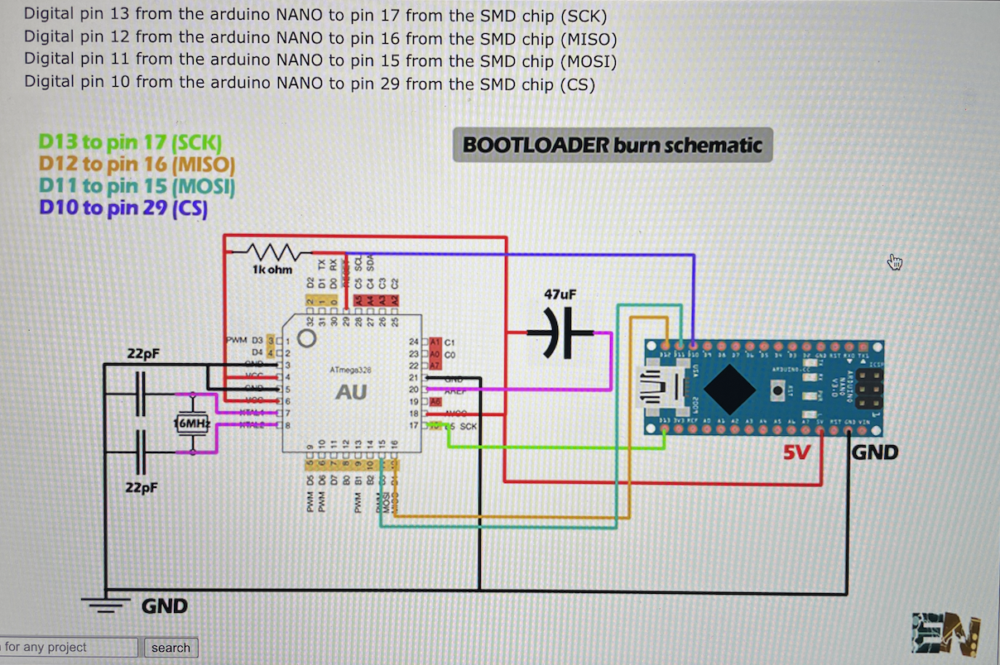

For this test we need to be able to install the bootloader on the atmega328p-au ans prgram it. The new PCB has the pins to be able to program it.

Youtube video:

### Instructions

### Bootloader usb

### Wiring diagram

